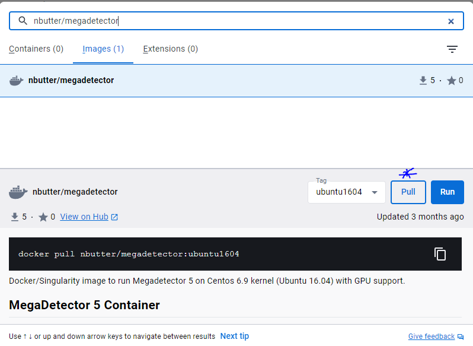
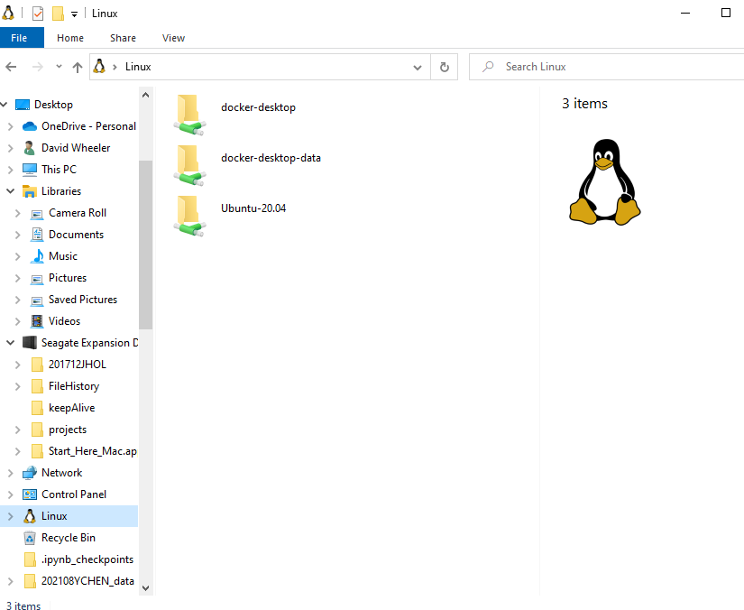
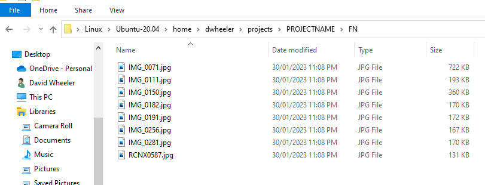
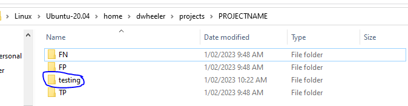

# A guide to using docker to share and use AI models  

- [Introduction](#introduction)
- [Instructions](#instructions)
  * [Install WSL using the windows store](#install-wsl-using-the-windows-store)
  * [Install Ubuntu linux using WSL](#install-ubuntu-linux-using-wsl)
  * [Install docker desktop for windows](#install-docker-desktop-for-windows)
- [QuickStart example using an image hosted on the docker hub](#quickstart-example-using-an-image-hosted-on-the-docker-hub)
  * [Create a free account on docker hub](#create-a-free-account-on-docker-hub)
- [Process camera trap images through megadetector (with GPU support)](#process-camera-trap-images-through-megadetector--with-gpu-support-)
  * [Accessing the output files](#accessing-the-output-files)
- [Advanced example building a megadetector image from a repo](#advanced-example-building-a-megadetector-image-from-a-repo)
  * [Install the Sydney Uni Megadetector v5 using Ubuntu](#install-the-sydney-uni-megadetector-v5-using-ubuntu)
  * [Check the image using the docker desktop app](#check-the-image-using-the-docker-desktop-app)
- [Common commands and how to manage your docker images and containers](#common-commands-and-how-to-manage-your-docker-images-and-containers)

<small><i><a href='http://ecotrust-canada.github.io/markdown-toc/'>Table of contents generated with markdown-toc</a></i></small>


# Introduction  
Docker allows you to share software environments in a system agnostic way. The following guide outlines how to build docker images, and then run them in containers. It also includes some key commands to manage your docker images and contains.  

# Instructions  
The following instructions are written for windows users who do not have Windows Subsystem for Linux (v2) instaled (WSL). If you are using linux you just need to install docker using apt.  

## Install WSL using the windows store    
1. Install Windows Subsystem for Linux (WSLv2) using the windows app store  
2. Type 'store' in the windows search box and select 'Microsoft store'
3. In the search bar at the top of the store search for 'WSL'


- Install the app and then **reboot your computer**

## Install Ubuntu linux using WSL  
1. Once again in the windows store search for 'Ubuntu 20.04 LTS' and install the app (at the time of writing the current version is 20.04.5)  

  

2. Launch the Ubuntu app terminal using the start menu, you will be asked for a username and password (This is only used for the ubuntu app itself to login to this enviroment)  
3. Apply updates by typing the following into the Ubuntu terminal window:  

```
sudo apt update && sudo apt upgrade -y
```

**Important info about copy and pasting these commands into a terminal**  
a) Copy and paste will work, just right click at the top of the terminal screen (on the white boarder), select EDIT->copy/paste  
b) Copy and paste is great, but it can be dangerious because sometimes the command will run right after you push 'paste'. For this reason I always type a hash (ie #) in the terminal window before pasting, in this way even if the commadn runs nothing will happen because everything after a hash is ignored by linux  
c) If you do the above and the command executed with the hash # at the start, just push the up arrow on the keyboard and modified the command (remove the hash this time) so that it executes properly  


  

4. Shutdown the app by closing the window (or typing `exit`)  

## Install docker desktop for windows  
1. Navigate to `www.docker.com/products/docker-desktop/` and click the Download Docker Desktop for windows button  
2. Install the application selecting `WSL` as the backend  
3. Check that everything is working by opening the `Docker Desktop` app from the start menu  

  

# QuickStart example using an image hosted on the docker hub
This is the quick start way of getting megadetector up and running using the docker hub version. This requires setting up a free account and then downloading the docker image that has been build via the team at Sydney Universities Inforatics Hub. An alternative option is to build it from the repo (This is further down the page if you are intested). To install from the hub you will need a docker hub account.  

## Create a free account on docker hub
1. Navigate to `hub.docker.com` and create a free account  
2. After creating your account an option will be available to connect to docker desktop (otherwise just login directly using the docker desktop app)  
3. In the search menu type `nbutter/megadetector` and click `pull`

    

Hopefully that is all that is required. Note I have included more advanced instructions below in case you want to build the app from source (this is not required if the above has worked for you).  

# Process camera trap images through megadetector (with GPU support)  
1. Open the Ubuntu App and create a place to store your images (**replace PROJECTNAME with your own meaningful name of your own (please dont use spaces, use an underscore instead, every linux user will thank you)**)

```
# replace PROJECTNAME with your own name (Don't use spaces!!)
mkdir -p ~/projects/PROJECTNAME
```

2. Copy your image files to the Ubuntu disk are using file explorer (see the figures below): in the linux disk your directory path would be `/home/USERNAME/projects/PROJECTNAME`  

  



You can copy directories with sub-directories if you like, the command we will use to run megadetector will look through all folders in the target directory.  

3. Check that your images copied across by typing the following in the Ubuntu app terminal
```
# replace PREJECTDIRECTORY with the name you used
cd ~/projects/PROJECTDIRECTORY
# this should print out files
ls
```

4. Run megadetector using the command line options to test the installation (will ask you for your password). Note the use of the `-h` flag here, this will print out the help, that will show all the possible options for running megadetector.    

NOTE: Everything below with `#` is just info that will be printed to your linux terminal window, please don't type anything with the hash as they are just comments. Once again if you copy and paste the code from the window below, be sure to type # in your terminal window, just in case it executes after the paste, use the up arrow to bring back the command (delete the hash), and then execute it manually by pushing ENTER on the keyboard.    

NOTE: The use of backticks around the "pwd" command, on my keyboard this key is on the top left on the same key as tilde ~.  

```
sudo docker run --gpus all -it -v `pwd`:/project nbutter/megadetector:ubuntu1604 /bin/bash -c "cd /project && python /build/cameratraps/detection/run_detector.py -h"

#usage: run_detector.py [-h] (--image_file IMAGE_FILE | --image_dir IMAGE_DIR) [--recursive] [--output_dir OUTPUT_DIR]
#                       [--image_size IMAGE_SIZE] [--threshold THRESHOLD] [--crop] [--box_thickness BOX_THICKNESS]
#                       [--box_expansion BOX_EXPANSION]
#                       detector_file
#
#Module to run an animal detection model on images
#
#positional arguments:
#  detector_file         Path to TensorFlow (.pb) or PyTorch (.pt) detector model file
#
#optional arguments:
#  -h, --help            show this help message and exit
#  --image_file IMAGE_FILE
#                        Single file to process, mutually exclusive with --image_dir
#  --image_dir IMAGE_DIR
#                        Directory to search for images, with optional recursion by adding --recursive
#  --recursive           Recurse into directories, only meaningful if using --image_dir
#  --output_dir OUTPUT_DIR
#                        Directory for output images (defaults to same as input)
#  --image_size IMAGE_SIZE
#                        Force image resizing to a (square) integer size (not recommended to change this)
#  --threshold THRESHOLD
#                        Confidence threshold between 0 and 1.0; only render boxes above this confidence (defaults to
#                        0.2)
#  --crop                If set, produces separate output images for each crop, rather than adding bounding boxes to
#                        the original image
#  --box_thickness BOX_THICKNESS
#                        Line width (in pixels) for box rendering (defaults to 4)
#  --box_expansion BOX_EXPANSION
#                        Number of pixels to expand boxes by (defaults to 0)
```

5. Now can use the above information to run megadetector so that it will (see above output for all command line options):  
a) processes all images (and sub-folders via `--recursive`) in the directory called `TP`  
b) creates output directory called `testing` containing images with boundary boxes around animal detections    
c) only draws boxes when detection probability is greater than 20%  

You can modify the command below based on the above to match your filenames/folders etc.  

**Note:** If you don't have a GPU (graphics card), then don't include the `--gpus all` part.    

```
sudo docker run --gpus all -it -v `pwd`:/project nbutter/megadetector:ubuntu1604 /bin/bash -c "cd /project && python /build/cameratraps/detection/run_detector.py /build/blobs/md_v5b.0.0.pt --image_dir ./TP --output_dir ./testing --threshold 0.2 --recursive"
```

Hopefully you can see that by changing the above command you can alter what images are processed, the detection threshold, and the output location. Note in the image below a new folder has been created called `testing` based on the `--output_dir` flag listed in the above command. This will contain our image files with detections.  



6. An alternative is to run megadetector in batch mode if you want to do downstream processing like removing empty images based on an ouput summary file that shows filenames and detection probabilities etc.  

**Note:** This mode won't create images with boundary boxes, it simply creates a JSON outfile. The advantage of this mode is that it saves disk space because output images are not being created. Note that you can still create these images latter using information contained in the JSON output file. You can also you use this file to filter out empty images etc (just get in touch if you have any questions about this).  

This command will:  
a) create a JSON file of outputs called `TP.json`  
b) only include detections above 20% probability  
c) save the output file every 1000 images (in case of crash etc)

```
sudo docker run --gpus all -it -v `pwd`:/project nbutter/megadetector:ubuntu1604 /bin/bash -c "cd /project && python /build/cameratraps/detection/run_detector_batch.py /build/blobs/md_v5b.0.0.pt ./TP TP.json --output_relative_filenames --recursive --threshold 0.2 --checkpoint_frequency 1000"
```

## Accessing the output files  
The commands above use your current working directory as a root directory, so any output files that are generated should be viewable in file explorer if you navigate to your linux disk space. You can copy these across. If you want a more user friendly version of JSON see the tools directory which has a script for converting JSON to CSV format that will open in excel.  


# Advanced example building a megadetector image from a repo   
The following instructions will build the docker image from the original repo. This is a little more advanced and will take around 30 minutes to install and download ~10GB from the internet.  

## Install the Sydney Uni Megadetector v5 using Ubuntu  
1. Open the Ubuntu app again from the start menu  
2. Check that docker works by typing:  
```
docker -h
```


3. Create a place to store the megadetector code and clone the repo  
```
# make a directory to storet the project (tildre is your home directory)
mkdir -p ~/projects/megadetector
# change into this new directory
cd ~/projects/megadetector
# clone the repo
git clone https://github.com/Sydney-Informatics-Hub/megadetector-contained.git
# change into the repo directory
cd megadetector-contained
# check the files available
ls
```


4. Build the docker image (this will take some time and download a significant portion of the entire internet (-;)   
```
# will ask you for your password
sudo docker build . -t nbutter/megadetector:ubuntu1604
```


## Check the image using the docker desktop app  
1. If the docker desktop app is closed open it now using the start menu  
2. If step 4 above was successful then you should see the new megadetector image agailable in the desktop app (click images) 


3. To run the app as described in the fast start section

# Common commands and how to manage your docker images and containers  
This of your docker images as computers, and your containers as running instances of the computer. 

To build a container from an image use the `docker run` commmand.  

```
# -it creates a terminal
# -v mounts a volume (in this case $(pwd)/projects
docker run -it -v `pwd`:/project user/name:tag /bin/bash -c "your command goes here"
```

Once the command is run the container will shutdown. To keep it open so you can continue to interact with it us the `-d` detacted mode. This is handy because don't have to keep creating new containers which uses up resources!  

```
# mounts your current working dir in /project in the container in detacted mode
docker run -it -d -v `pwd`:/project user/name:tag
```

Once this container is created you can interact with it via its name. This is much quicker than using the `run` command each time. Also, using `run` will result in a build up of containers that take up disk space, so `exec` is definitely the way to go! 

To find out the containers that are currently available and there status use, note the HASH and NAME can be used to interact with the container:  

```
docker ps -a
```

The name can be used to start and then execute commands within that container environment.  
```
docker start NAME
docker exec -it CONTAINER_NAME /bin/bash -c "YOUR COMMAND"
# an example
docker exec -it keen_franklin /bin/bash -c "echo hello"
```

You can even modify files within the container if you installed vim as part of the build process through the Dockerfile.  

```
docker exec -it keen_franklin /bin/bash -c "vim somefile.txt"
```
Or if you just want to log in an interact as if this was a real session.  
```
docker exec -it keen_franklin /bin/bash
```

Once you are done with a container it can be deleted using its name or hash.  
```
docker stop CONTAINER_NAME
docker rm CONTAINER_NAME
```
