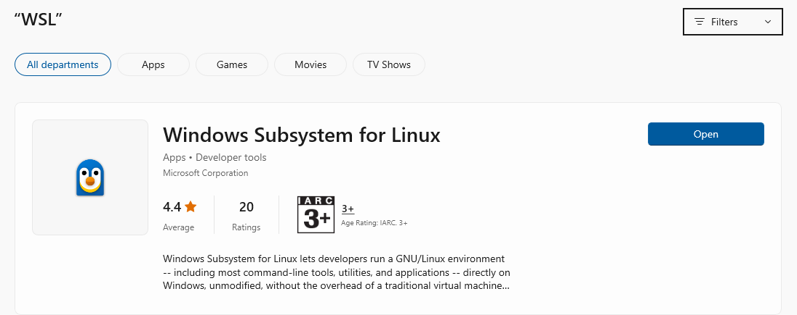
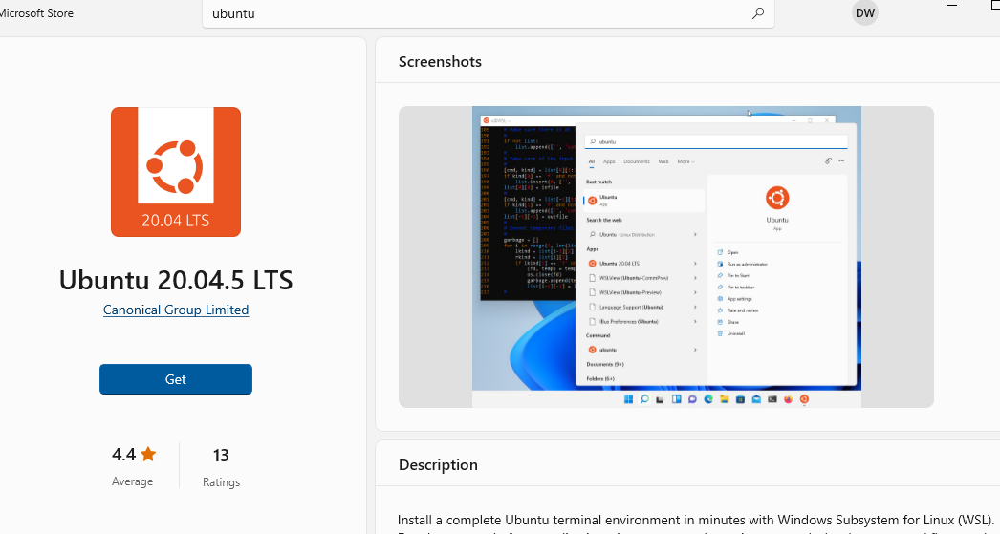
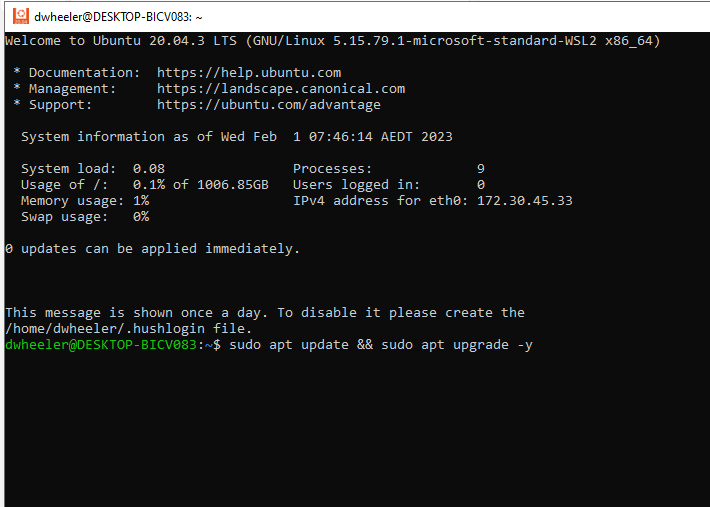
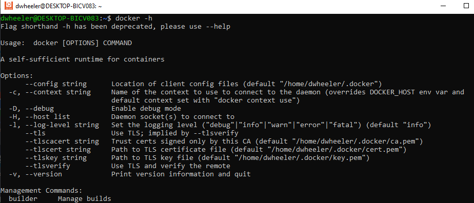
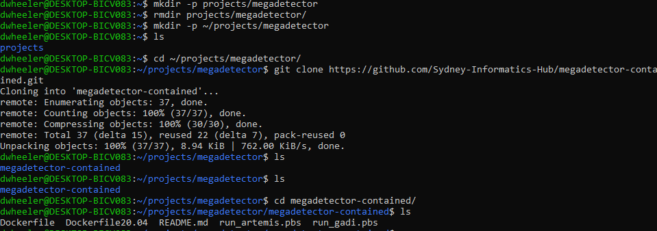
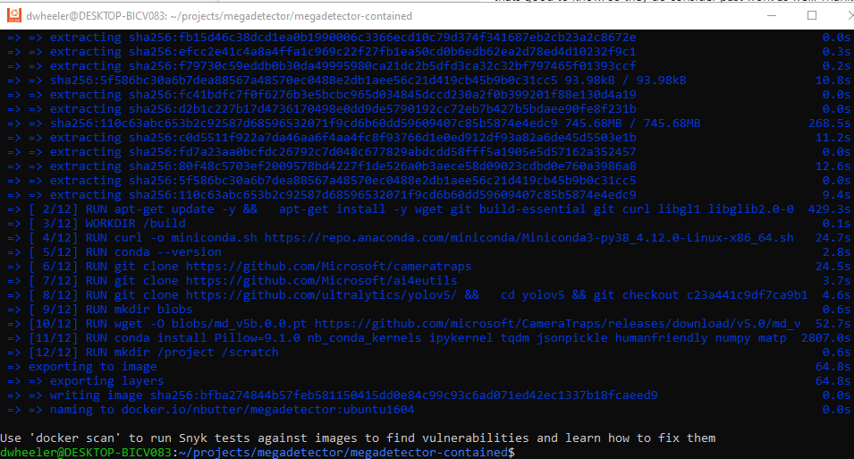
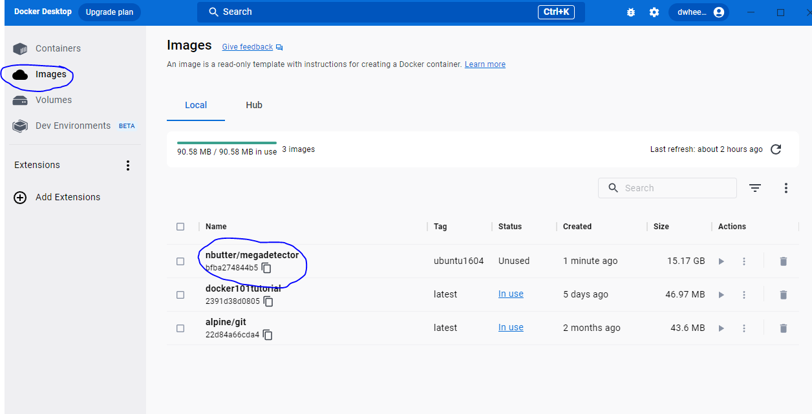

# 202302lgonsalves  

# Introduction  
Installing and running megadetector (V5) in a docker invironment on windows.  

# Acknowledgements  
If you use this code please acknowledge the original authors from the Sydney University Informatics Hub, as per their note below from the original repo.

**If you have used this work for a publication, you must acknowledge SIH, e.g: "The authors acknowledge the technical assistance provided by the Sydney Informatics Hub, a Core Research Facility of the University of Sydney."**

# Megadetector repo source   
https://github.com/Sydney-Informatics-Hub/megadetector-contained

# Instructions  

## Install WSL using the windows store    
1. Install Windows Subsystem for Linux (WSLv2) using the windows app store  
2. Type 'store' in the windows search box and select 'Microsoft store'
3. In the search bar at the top of the store search for 'WSL'



- Install the app and then **reboot your computer**

## Install Ubuntu linux using WSL  
1. Once again in the windows store search for 'Ubuntu 20.04 LTS' and install the app (at the time of writing the current version is 20.04.5)  

  

2. Launch the Ubuntu app using the start menu, you will be asked for a username and password
3. Apply updates by typing the following:  
```
sudo apt update && sudo apt upgrade -y
```

  

4. Shutdown the app by closing the window (or typing `exit`)  

## Install docker desktop for windows  
1. Navigate to `www.docker.com/products/docker-desktop/` and click the Download Docker Desktop for windows button  
2. Install the application selecting `WSL` as the backend  
3. Check that everything is working by opening the `Docker Desktop` app from the start menu  

  

# QuickStart: Megadetetor from the docker hub
This is the quick start way of getting megadetector up and running using the docker hub version. This requires setting up a free account and then downloading the docker image that has been build via the team at Sydney Universities Inforatics Hub. An alternative option is to build it from the repo (This is further down the page if you are intested). To install from the hub you will need a docker hub account.  

## Create a free account on docker hub
1. Navigate to `hub.docker.com` and create a free account  
2. After creating your account an option will be available to connect to docker desktop (otherwise just login directly using the docker desktop app)  
3. In the search menu type `nbutter/megadetector` and click `pull`

![Figure 4.1: Pull the megadetector image from the docker hub(images/figure4.1.png)    

4. Run the app xxxxxx

Hopefully that is all that is required. Note I have included more advanced instructions below in case you want to build the app from source (this is not required if the above has worked for you).  

# Process camera trap images through megadetector (with GPU support)  
1. Open the Ubuntu App and create a place to store your images (**replace PROJECTNAME with your own meaningful name of your own (please dont use spaces, use an underscore instead, every linux user will thank you)**)

```
# replace PROJECTNAME with your own name (Don't use spaces!!)
mkdir -p ~/projects/PROJECTNAME
```

1. Copy your image files to the Ubuntu disk are using file explorer (see figure below)

## Accessing files


# Advanced: Building the megadetector image from the repo   
The following instructions will build the docker image from the original repo. This is a little more advanced and will take around 30 minutes to install and download ~10GB from the internet.  

## Install the Sydney Uni Megadetector v5 using Ubuntu  
1. Open the Ubuntu app again from the start menu  
2. Check that docker works by typing:  
```
docker -h
```



3. Create a place to store the megadetector code and clone the repo  
```
# make a directory to storet the project (tildre is your home directory)
mkdir -p ~/projects/megadetector
# change into this new directory
cd ~/projects/megadetector
# clone the repo
git clone https://github.com/Sydney-Informatics-Hub/megadetector-contained.git
# change into the repo directory
cd megadetector-contained
# check the files available
ls
```



4. Build the docker image (this will take some time and download a significant portion of the entire internet (-;)   
```
# will ask you for your password
sudo docker build . -t nbutter/megadetector:ubuntu1604
```



## Check the image using the docker desktop app  
1. If the docker desktop app is closed open it now using the start menu  
2. If step 4 above was successful then you should see the new megadetector image agailable in the desktop app (click images) 



3. To run the app, click hte little play icon in the "actions" section.


