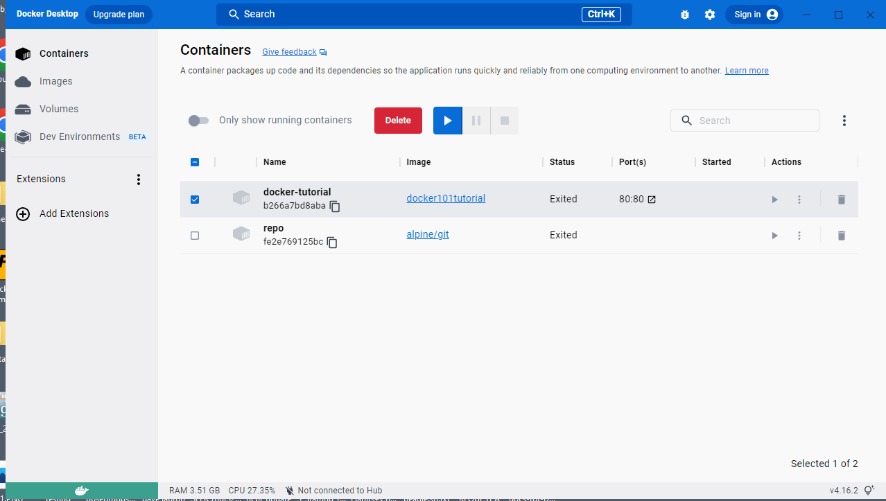
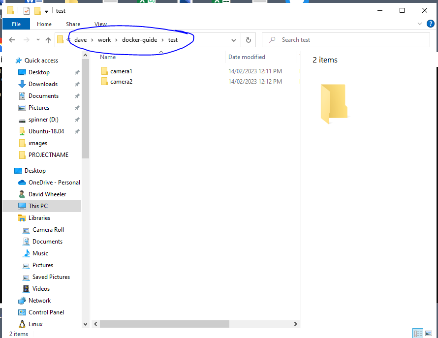
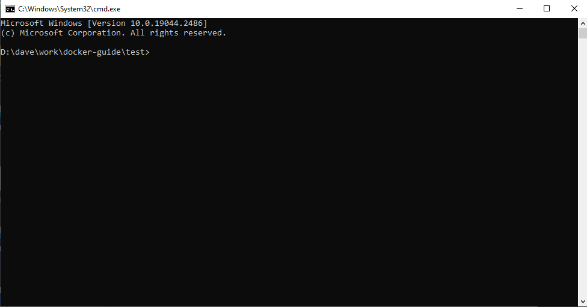
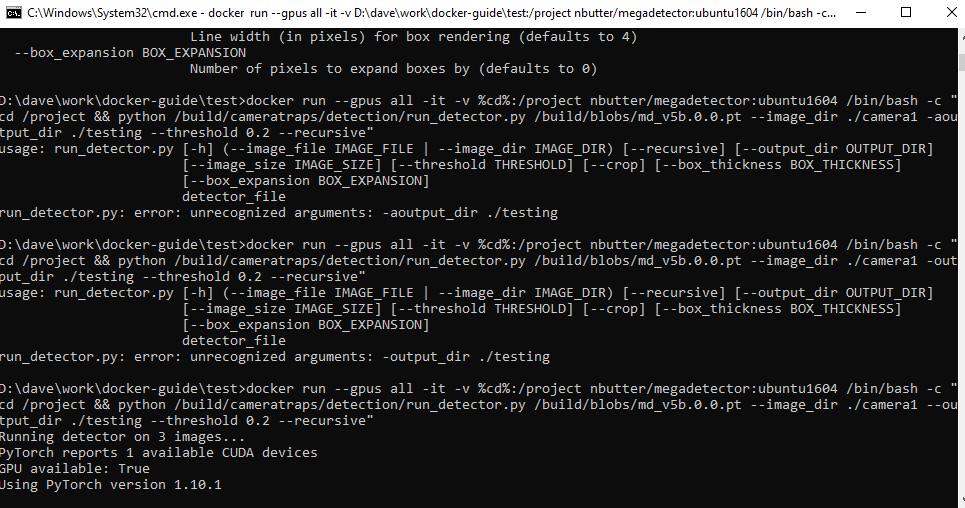

# A guide for using docker to share and use AI models  

- [Introduction](#introduction)
- [Instructions](#instructions)
  * [Install docker desktop for windows](#install-docker-desktop-for-windows)
- [QuickStart example using an image hosted on the docker hub](#quickstart-example-using-an-image-hosted-on-the-docker-hub)
- [Process camera trap images through megadetector (with GPU support)](#process-camera-trap-images-through-megadetector--with-gpu-support-)
  * [Install the Sydney Uni Megadetector v5 using Ubuntu](#install-the-sydney-uni-megadetector-v5-using-ubuntu)

# Introduction  
Docker allows you to share software environments in a system agnostic way. The following guide outlines how to build docker images, and then run them in containers. It also includes some key commands to manage your docker images and contains.  

# Instructions  
The following instructions are written for windows users, if you are using Linux you just need to install docker using apt.  

## Install docker desktop for windows  
1. Navigate to `www.docker.com/products/docker-desktop/` and click the Download Docker Desktop for windows button  
2. Install the application selecting `WSL` as the backend (should be the default options)   
3. Check that everything is working by opening the `Docker Desktop` app from the start menu  

  

# QuickStart example using an image hosted on the docker hub
This is the quick start way of getting the camera trap AI software megadetector up and running using the docker hub version. This requires setting up a free account and then downloading the docker image that has been build via the team at Sydney Universities Inforatics Hub.  

## Process camera trap images through megadetector (with GPU support)  
Use the file explore navigate to the directory where your images are stored. In the file path bar (circled below)
type `cmd` to open a command prompt in this current directory.  



 

Next we pull the megadetector image from docker, copy and paste or type the following at the command prompt.  
If you copy the command you can paste it by right clicking on the top border of the command prompt terminal window. 

```
docker pull nbutter/megadetector:ubuntu1604
```

The next command will mount your current directory in the docker container and print out the help message 
just to confirm that everything is working as expected.  

```
docker run --gpus all -it -v %cd%:/project nbutter/megadetector:ubuntu1604 /bin/bash -c "cd /project && python /build/cameratraps/detection/run_detector.py -h"
```

The following message should print out
```
#usage: run_detector.py [-h] (--image_file IMAGE_FILE | --image_dir IMAGE_DIR) [--recursive] [--output_dir OUTPUT_DIR]
#                       [--image_size IMAGE_SIZE] [--threshold THRESHOLD] [--crop] [--box_thickness BOX_THICKNESS]
#                       [--box_expansion BOX_EXPANSION]
#                       detector_file
#
#Module to run an animal detection model on images
#
#positional arguments:
#  detector_file         Path to TensorFlow (.pb) or PyTorch (.pt) detector model file
#
#optional arguments:
#  -h, --help            show this help message and exit
#  --image_file IMAGE_FILE
#                        Single file to process, mutually exclusive with --image_dir
#  --image_dir IMAGE_DIR
#                        Directory to search for images, with optional recursion by adding --recursive
#  --recursive           Recurse into directories, only meaningful if using --image_dir
#  --output_dir OUTPUT_DIR
#                        Directory for output images (defaults to same as input)
#  --image_size IMAGE_SIZE
#                        Force image resizing to a (square) integer size (not recommended to change this)
#  --threshold THRESHOLD
#                        Confidence threshold between 0 and 1.0; only render boxes above this confidence (defaults to
#                        0.2)
#  --crop                If set, produces separate output images for each crop, rather than adding bounding boxes to
#                        the original image
#  --box_thickness BOX_THICKNESS
#                        Line width (in pixels) for box rendering (defaults to 4)
#  --box_expansion BOX_EXPANSION
#                        Number of pixels to expand boxes by (defaults to 0)
```

Now we can use the above information to run megadetector so that it will (see above output for all command line options):  
a) processes all images (and sub-folders via `--recursive`) in the directory called `camera1`  
b) creates output directory called `testing` containing images with boundary boxes around animal detections    
c) only draws boxes when detection probability is greater than 20%  

You need to modify the `--image_dir` to target the directory with your images, in this case I am processing
images in the `camera1` directory.  

**Note:** If you don't have a GPU (graphics card), then don't include the `--gpus all` part.    

```
docker run --gpus all -it -v %cd%:/project nbutter/megadetector:ubuntu1604 /bin/bash -c "cd /project && python /build/cameratraps/detection/run_detector.py /build/blobs/md_v5b.0.0.pt --image_dir ./camera1 --output_dir ./testing --threshold 0.2 --recursive"
```
Note: pushing the up arrow in the keyboard will bring back the last command typed. 

  

Hopefully you can see that by changing the above command you can alter what images are processed, the detection threshold, and the output location. Note in the image below a new folder has been created called `testing` based on the `--output_dir` flag listed in the above command. This will contain our image files with detections.  


An alternative is to run megadetector in batch mode if you want to do downstream processing like removing empty images based on an ouput summary file that shows filenames and detection probabilities etc.  

**Note:** This mode won't create images with boundary boxes, it simply creates a JSON outfile. The advantage of this mode is that it saves disk space because output images are not being created. Note that you can still create these images latter using information contained in the JSON output file. You can also you use this file to filter out empty images etc (just get in touch if you have any questions about this).  

This command will:  
a) create a JSON file of outputs called `camera.json`  
b) only include detections above 20% probability  
c) save the output file every 1000 images (in case of crash etc)

```
docker run --gpus all -it -v %cd%:/project nbutter/megadetector:ubuntu1604 /bin/bash -c "cd /project && python /build/cameratraps/detection/run_detector_batch.py /build/blobs/md_v5b.0.0.pt ./camera1 camera1.json --output_relative_filenames --recursive --threshold 0.2 --checkpoint_frequency 1000"
```
